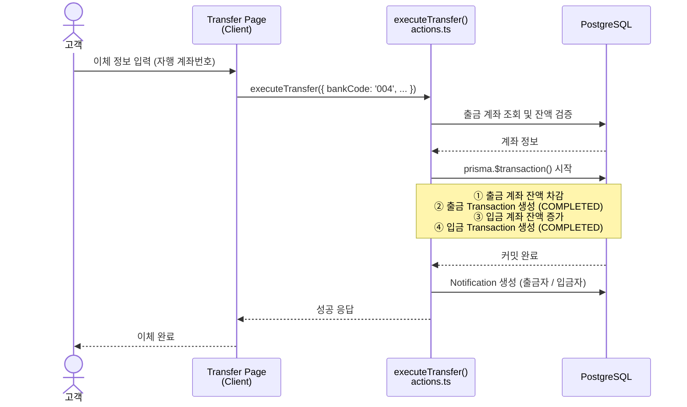
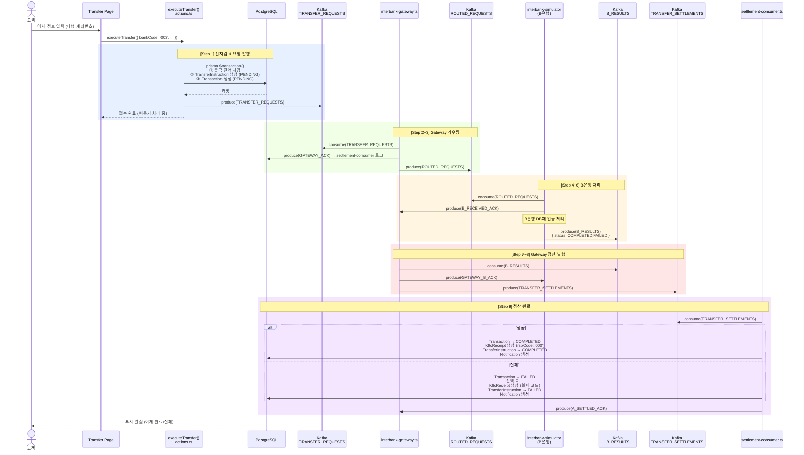
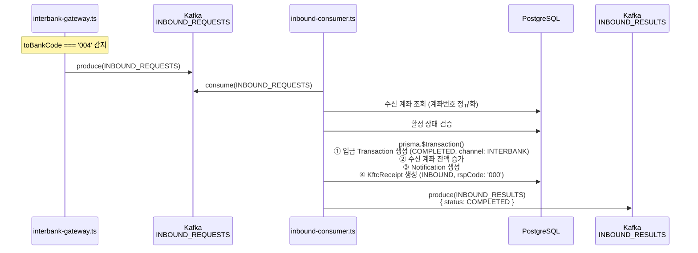
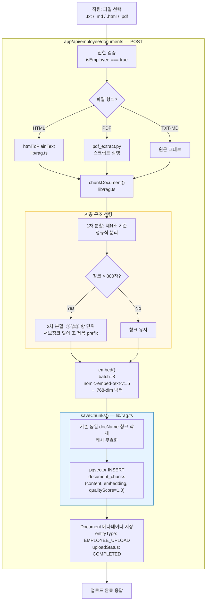
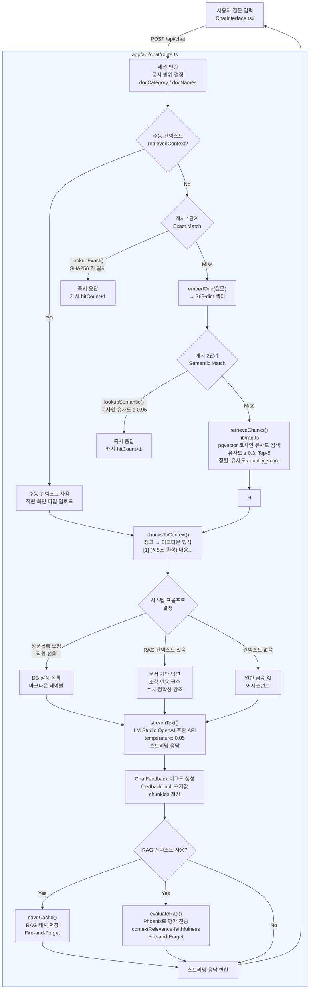
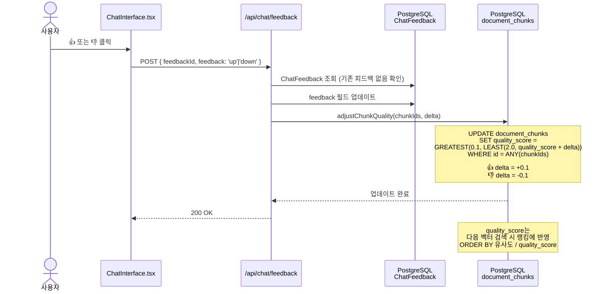

# FIN-Mate 아키텍처 흐름도

## 목차
1. [이체 트랜잭션 흐름](#1-이체-트랜잭션-흐름)
   - 1-1. 자행이체 (즉시 처리)
   - 1-2. 타행이체 (Kafka 비동기)
   - 1-3. 타행 → FIN-Mate 입금 (Inbound)
2. [RAG 흐름](#2-rag-흐름)
   - 2-1. 문서 업로드 · 인덱싱
   - 2-2. 채팅 질문 처리
   - 2-3. 피드백 반영

---

## 1. 이체 트랜잭션 흐름

### 1-1. 자행이체 (동기 · DB 직접 처리)



**관련 파일**
| 파일 | 역할 |
|------|------|
| `app/(main)/transfer/actions.ts` | Server Action — 전체 이체 로직 |
| `lib/notifications.ts` | 알림 생성 유틸 |
| `prisma/schema.prisma` | `Transaction`, `Account`, `Notification` 모델 |

---

### 1-2. 타행이체 (Kafka 비동기 9-Step)



**Kafka 토픽 목록**
| 토픽 | 발행자 | 소비자 | 내용 |
|------|--------|--------|------|
| `interbank-transfer-requests` | FIN-Mate | Gateway | 이체 요청 |
| `interbank-gateway-ack` | Gateway | FIN-Mate | 수신 ACK |
| `interbank-routed-requests` | Gateway | B은행 시뮬레이터 | 타행 라우팅 |
| `interbank-b-received-ack` | B은행 | Gateway | B 수신 ACK |
| `interbank-b-results` | B은행 | Gateway | 처리 결과 |
| `interbank-gateway-b-ack` | Gateway | B은행 | 결과 수신 ACK |
| `interbank-transfer-settlements` | Gateway | FIN-Mate | 최종 정산 |
| `interbank-a-settled-ack` | FIN-Mate | Gateway | 정산 완료 ACK |

**관련 파일**
| 파일 | 역할 |
|------|------|
| `app/(main)/transfer/actions.ts` | Step 1 — 선차감 + 첫 메시지 발행 |
| `lib/kafka.ts` | KafkaJS 싱글턴, 토픽 상수 정의 |
| `workers/interbank-gateway.ts` | Step 2·3·7·8 — 공동망 라우터 |
| `workers/settlement-consumer.ts` | Step 9 — A은행 정산 처리 |
| `interbank-simulator/` | Step 4·5·6 — B은행 시뮬레이터 (SQLite) |

---

### 1-3. 타행 → FIN-Mate 입금 (Inbound)



---

## 2. RAG 흐름

### 2-1. 문서 업로드 · 인덱싱



**DB 스키마 (관련 테이블)**

```
document_chunks
├── id              UUID PK
├── doc_name        VARCHAR  ← storedName과 매칭되는 검색 키
├── article_num     VARCHAR  ← 제N조
├── section_num     VARCHAR  ← ①②③ 항
├── content         TEXT
├── embedding       vector(768)  ← pgvector
└── quality_score   FLOAT    ← 피드백으로 조정 (0.1 ~ 2.0, 기본 1.0)

rag_cache
├── cache_id        UUID PK
├── cache_key       VARCHAR  ← SHA256(정규화질문 + doc_scope)
├── question        TEXT
├── doc_scope       VARCHAR
├── answer          TEXT
├── chunk_ids       UUID[]
├── embedding       vector(768)
└── hit_count       INT
```

---

### 2-2. 채팅 질문 처리



**컨텍스트 우선순위**
```
① 직원 상품 목록 DB 조회 결과
② 수동 컨텍스트 (ChatInterface 파일 업로드)
③ RAG 벡터 검색 결과 (document_chunks)
④ 없음 (일반 대화)
```

---

### 2-3. 피드백 반영



**피드백이 검색 품질에 미치는 영향**

```
좋은 답변 (👍 누적) → quality_score ↑ → 동일 유사도에서 높은 순위
나쁜 답변 (👎 누적) → quality_score ↓ → 동일 유사도에서 낮은 순위

검색 정렬 기준: embedding <=> queryVec / NULLIF(quality_score, 0)
  → quality_score가 클수록 거리값이 작아져 상위 랭크
```

---

## 전체 시스템 구성

```mermaid
graph TB
    subgraph CLIENT ["클라이언트 (Next.js App Router)"]
        UI_TRANSFER[이체 화면]
        UI_CHAT[채팅 화면]
        UI_LOAN[대출 심사]
    end

    subgraph NEXTJS ["Next.js API / Server Actions"]
        ACT_TRANSFER[transfer/actions.ts]
        API_CHAT[/api/chat]
        API_LOAN[/api/loan-applications]
        API_DOC[/api/employee/documents]
    end

    subgraph WORKERS ["Kafka Workers (Node.js)"]
        GW[interbank-gateway]
        SC[settlement-consumer]
        IC[inbound-consumer]
        SIM[interbank-simulator\nB은행]
    end

    subgraph INFRA ["인프라"]
        KAFKA[(Kafka Broker)]
        PG[(PostgreSQL\n+ pgvector)]
        LM[LM Studio\nOllama 호환 API]
        PHOENIX[Arize Phoenix\n트레이싱·평가]
        ML[ML Inference Server\nFastAPI :8001]
    end

    UI_TRANSFER --> ACT_TRANSFER
    UI_CHAT --> API_CHAT
    UI_LOAN --> API_LOAN
    UI_CHAT --> API_DOC

    ACT_TRANSFER -->|자행| PG
    ACT_TRANSFER -->|타행| KAFKA
    API_CHAT --> LM
    API_CHAT --> PG
    API_DOC --> LM
    API_DOC --> PG
    API_LOAN --> ML

    KAFKA --> GW --> KAFKA
    KAFKA --> SC --> PG
    KAFKA --> IC --> PG
    KAFKA --> SIM --> KAFKA

    API_CHAT --> PHOENIX
    ML --> PHOENIX
```
